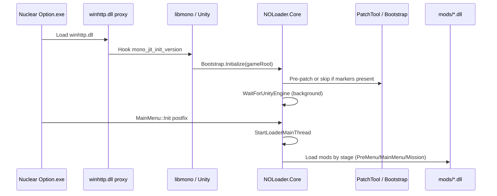

# NOLoader — architecture

Standalone mod loader for **Nuclear Option** (Unity Mono). Replaces BepInEx for new mods: native bootstrap → managed core → declarative `mod.json` → Mono.Cecil IL patches → validation gates.

**Game API reference (mandatory for patches):** `C:\Users\at747\Desktop\CH\_Nuclear_Option_\Assembly-CSharp\` — never invent types or signatures.

---

## High-level flow

---

## Repository layout

| Path | Role |
|------|------|
| `native/NOLoader.Proxy/` | C++ `winhttp.dll` — IAT hook, forwards to system winhttp, invokes Mono bootstrap |
| `src/NOLoader.API/` | `INOMod`, `mod.json` types, Murmur32 string hash, `LoaderLog` |
| `src/NOLoader.Core/` | Bootstrap, gates, mod lifecycle, logging, DEV overlay (`#if NOLoader_DEV`) |
| `src/NOLoader.Patcher/` | Mono.Cecil `AssemblyPatcher`, patch plans, signature hashes |
| `src/NOLoader.PatchTool/` | Offline CLI — pre-patch game `Managed/*.dll` before launch |
| `src/NOLoader.Registry/` | `NOModRegistry`, encyclopedia bridge, optional physics catch hooks |
| `src/NOLoader.Telemetry/` | UDP NO2 telemetry (**DEV.SDK only**, not linked in RDYTU) |
| `DEV.SDK/` | Developer solution, sample mods, diag mods |
| `RDYTU/` | Release solution (optimized core, no telemetry, no overlay) |
| `deploy/` | `noloader_config.ini`, empty `mods/` README |
| `tests/` | Core + Patcher unit/integration tests |

**Operational scripts** (deploy, verify, bake hashes) live outside the repo:

`C:\Users\at747\Desktop\CH\_NOLoader_scripts_\`

---

## Native proxy (`NOLoader.Proxy`)

- Deployed as `winhttp.dll` in the **game root** (same pattern as BepInEx Doorstop, but custom implementation).
- Does **not** call `mono_jit_init` from `DllMain` (loader lock / deadlock avoidance).
- Hooks `GetProcAddress` → intercepts `mono_jit_init_version` → loads `NOLoader.Core.dll` → `Bootstrap.Initialize(gameRoot)`.
- Logs to `NOLoader/logs/proxy.log`.

**Remove BepInEx** `winhttp.dll` / `doorstop_config.ini` before installing NOLoader.

---

## Bootstrap (`NOLoader.Core.Bootstrap`)

Single entry for managed code.

| Phase | Thread | What happens |
|-------|--------|----------------|
| `Initialize` | Mono init | Load INI → `RuntimeConfig`, build `ModAssemblyCache`, read manifests (Gate L1), Cecil pre-patch or skip if `patch_state.txt` / markers, start `WaitForUnityEngine` thread |
| `OnMainMenuReady` | Unity main | Postfix on `MainMenu::Init` → `StartLoaderMainThread` once |
| `StartLoaderMainThread` | Unity main | Init registry, load PreMenu/MainMenu mods, `NotifyMainMenuReady`, install Gate L4, DEV overlay/telemetry if DEV |

**Assembly resolve:** game `Managed/` → `NOLoader/core/` → mod folders (cached).

**Patch detection:** `NOLoader/patch_state.txt` (written by PatchTool) then binary marker scan — avoids full-DLL string allocation.

---

## Cecil / patching

### Offline (PatchTool — run with game **closed**)

Patches written to disk; creates `*.noloader.bak` backups on first run:

| Module | Core hooks |
|--------|------------|
| `Assembly-CSharp.dll` | `MainMenu::Init`, `Encyclopedia::AfterLoad`, optional `Motor::Thrust`, `MapLoader::CanLoad` |
| `UnityEngine.CoreModule.dll` | `SceneManager::LoadSceneAsync` (Gate L4) |
| `UnityEngine.PhysicsModule.dll` | Optional `Rigidbody::AddForce` (DEV default on; RDYTU off) |

### Runtime (Bootstrap)

If markers already present → skip Cecil for core; apply **mod** patches via `ModPatchScheduler` by load stage.

### Patch methods

| Method | Semantics |
|--------|-----------|
| `Prefix` | Run before original; can skip original |
| `Postfix` | Run after original |
| `PrefixSkip` | Return `bool` — `false` skips original call |

**Gate L2:** mod patches require `expectedSignatureHash` (SHA256 first 16 hex of method signature). Mismatch → rollback snapshot, patch not applied.

---

## Mod lifecycle

### Load stages (`LoadStage`)

| Stage | When activated |
|-------|----------------|
| `PreMenu` | Core start (before main menu ready) |
| `MainMenu` | `MainMenu::Init` hook / `NotifyMainMenuReady` |
| `Mission` | `SceneManager.sceneLoaded` (non-menu scene) — **only if** a mod declares `loadStage: Mission` |

RDYTU with **core only** (no mods): no mission observer, no `Update()` polling.

### Manifest (`mod.json`)

See [MOD_AUTHOR.md](MOD_AUTHOR.md). DEV.SDK uses plain `id`; RDYTU player packs use **hash-only** (`idHash`, patch hashes in `patch.bake.json`).

### Topological load

Dependencies resolved DFS; cycles rejected at Gate L1.

---

## Gates

| Gate | Layer | Purpose |
|------|-------|---------|
| **L1** | Manifest | Schema, duplicate ids, dependency cycles |
| **L2** | IL patch | Signature hash, rollback on failure |
| **L3** | Registry | ScriptableObject validation before encyclopedia inject |
| **L4** | Mission | Block mission load if mod fault; optional stack trace subscription |

Details: [GATES.md](GATES.md).

---

## Registry & physics (optional)

- **`NOModRegistry`** — in-memory missiles / weapon mounts / aircraft entries (hash keys).
- **`RegistryGameBridge.OnEncyclopediaAfterLoad`** — Cecil postfix injects registry content into game encyclopedia.
- **`PhysicsCatchHooks`** — optional sanitizers; **off by default in RDYTU** (`noloader_config.ini`).

---

## Logging

| Log | Location | RDYTU default |
|-----|----------|---------------|
| Native proxy | `NOLoader/logs/proxy.log` | always |
| Ring buffer | `NOLoader/logs/noloader_ring.log` | **off** (`ring_log=0`) |
| Bootstrap fatal | `NOLoader/logs/bootstrap_fatal.txt` | on crash |

---

## Build configurations

| Config | Define | Used by |
|--------|--------|---------|
| `DEV_SDK` | `NOLoader_DEV` | DEV.SDK solution — overlay, hot-reload, telemetry, verbose gates UI |
| `RDYTU` | (none) | RDYTU solution — minimal runtime overhead |

Same source tree; `#if NOLoader_DEV` strips dev code from RDYTU binaries.

---

## Performance design (RDYTU)

Measured baseline ~**1 FPS** vs vanilla (user field test, core only, no mods):

- No `MonoBehaviour.Update` polling (mission via `sceneLoaded` only when needed).
- No telemetry DLL, no overlay, no hot-reload.
- No global `Rigidbody.AddForce` hooks by default.
- No `Motor::Thrust` hook by default.
- Ring log off; exception log subscription off unless INI enabled.
- Gate L4 hot path: single int check when not blocked.

Config: `deploy/noloader_config.ini` section `[RDYTU]`.
